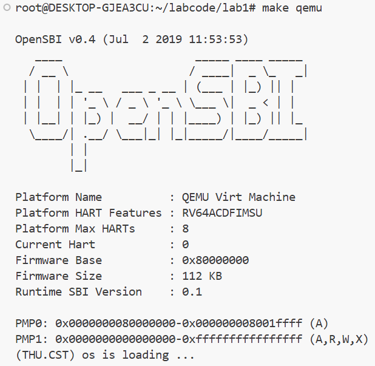
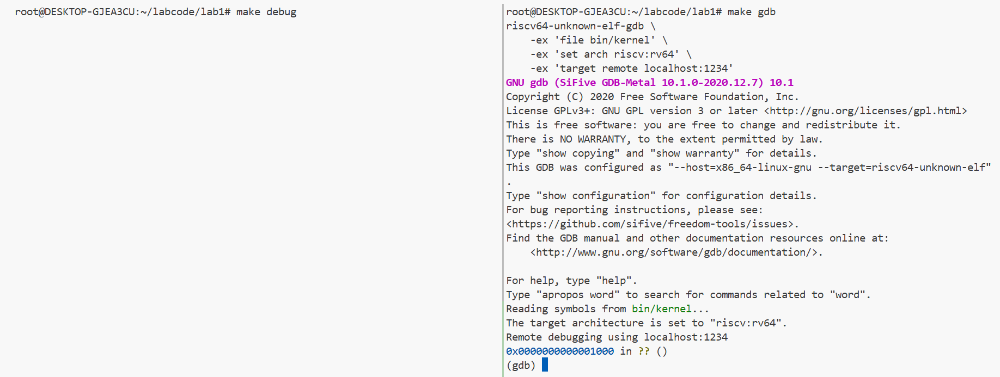
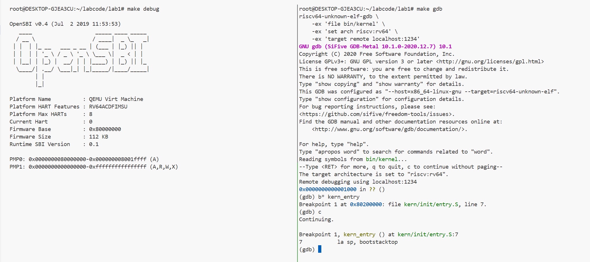
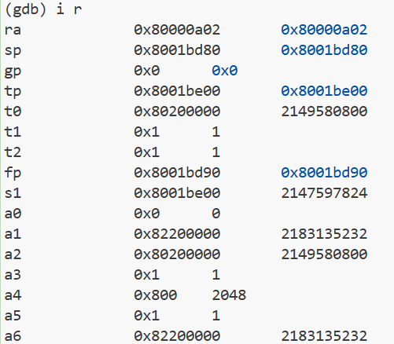
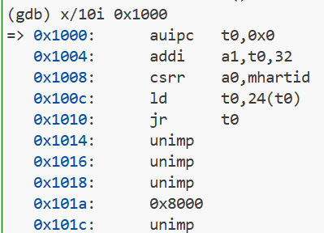
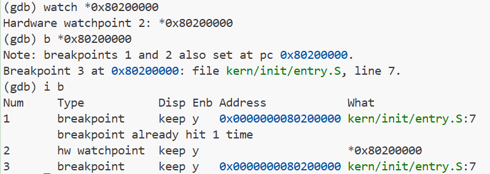
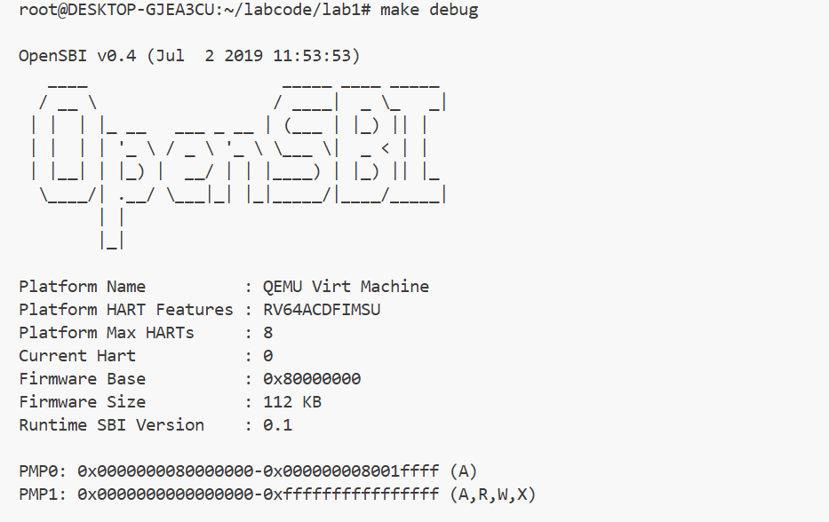
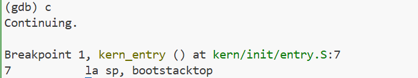
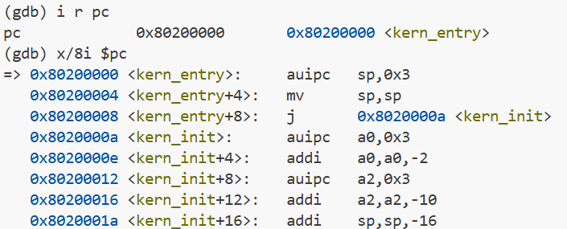

# 操作系统第一次实验

杨博涵 张耕嘉 刘嘉昊

## 练习1：理解内核启动中的程序入口操作

> 阅读 kern/init/entry.S内容代码，结合操作系统内核启动流程，说明指令 la sp, bootstacktop 完成了什么操作，目的是什么？ tail kern_init 完成了什么操作，目的是什么？

首先我们从实验平台下载代码：

*entry.S*

```asm
#include <mmu.h>
#include <memlayout.h>

    .section .text,"ax",%progbits
    .globl kern_entry
kern_entry:
    la sp, bootstacktop

    tail kern_init

.section .data
    # .align 2^12
    .align PGSHIFT
    .global bootstack
bootstack:
    .space KSTACKSIZE
    .global bootstacktop
bootstacktop:
```

我们有两个问题，下面我们一一道来：

### 问题一：指令la sp, bootstacktop完成了什么操作，目的是什么？

la 是 "load address" 的伪指令，所以这条命令即是将bootstacktop的地址加载到sp（栈指针）寄存器中，设置内核的初始栈指针。

其中bootstacktop 是在数据段（.data）中定义的一个标签，它位于内核栈空间（bootstack）的顶部。在数据段中，我们首先按照页大小（即4KB对齐）对齐，然后分配一段大小为 KSTACKSIZE 的空间，标签 bootstack 表示这段空间的起始，bootstacktop 表示结束（即栈顶）。

栈通常从高地址向低地址增长，所以将栈指针初始化为 bootstacktop是最高地址。栈示意图如下图所示。

```
高地址 ->  +---------------+
          | bootstacktop  | <- sp (栈顶)
          |               |
          |   栈空间       |  (向下增长)
          |               |
低地址 ->  +---------------+
          | bootstack     |  (栈底)
```

初始时 sp = bootstacktop，后续 push 操作会递减 sp

而这条命令的目的是：**建立内核堆栈：为内核代码执行提供堆栈空间**

这是因为在执行C语言代码之前，必须设置好栈，因为C语言代码中的函数调用、局部变量等都依赖于栈。

### 问题二：tail kern_init完成了什么操作，目的是什么？

tail 是一个尾调用指令，尾调用意味着当前函数**不保存返回地址**、**不新建栈帧**，而是跳转到目标函数，并复用当前栈帧，所以尾调用不会创建新的栈帧。这里tail kern_init 即跳转到 kern_init 函数，而kern_init 函数是内核的C语言初始化函数。

tail指令可以拆解为以下的RISC-V代码：

```asm
auipc x6, offset_hi   # 将目标地址的高20位与当前PC相加，存入临时寄存器x6
jalr x0, x6, offset_lo # 使用jalr指令跳转到x6+offset_lo，并将返回地址丢弃（写入x0）
```

而x0 是零寄存器，写入无效，这里使用了临时寄存器x6（即t1），因为尾调用不需要保存返回地址，所以使用jalr指令将返回地址写入x0（零寄存器），相当于丢弃。

总之这条命令的作用主要有三点：

1. 跳转：无条件跳转到目标函数。

2. 栈帧：不分配新的栈帧，复用当前栈帧。这意味着被调用函数将使用当前函数的栈空间。

3. 返回地址：不保存返回地址（即不修改ra寄存器）。因此，被调用函数返回时，将返回到当前函数的调用者，而不是tail指令之后的位置。

而从整个代码来看，kern_entry是内核入口点，它设置好栈指针后，通过尾调用进入kern_init。这样，kern_init将使用为kern_entry准备的栈空间。这样设计是因为内核初始化函数不会返回到这里，而是会继续执行直到系统运行。

## 练习2: 使用GDB验证启动流程

> 为了熟悉使用 QEMU 和 GDB 的调试方法，请使用 GDB 跟踪 QEMU 模拟的 RISC-V 从加电开始，直到执行内核第一条指令（跳转到 0x80200000）的整个过程。通过调试，请思考并回答：RISC-V 硬件加电后最初执行的几条指令位于什么地址？它们主要完成了哪些功能？请在报告中简要记录你的调试过程、观察结果和问题的答案。

### GDB调试工具使用体验

我们的内核在 **QEMU** 上运行，QEMU 可仿真一台 64 位 **RISC-V**计算机。按照 **Lab 0** 的指引，我们在 **Ubuntu 22.04** 上完成了实验环境配置。在源代码的根目录下`make qemu`，即可启动qemu。下图展示了 **OpenSBI** 的启动日志。接下来我们将实现基于 **SBI** 的 RISC-V 启动流程。



借助文档中的指引，我们成功得到能理解RISC-V架构指令集的GDB。然后利用tmux实现会话管理。我们分别在左右两个窗格输入“make debug”和“make gdb”，当GDB成功连上QEMU后，它会告诉我们：“现在程序停在了地址0x1000这个地方”。这里其实是QEMU内置的固件代码，还没执行到我们的内核。

在文档指引下，我们找到了**带 RISC-V 目标支持的 GDB**（即 `riscv64-unknown-elf-gdb`），并借助 **tmux** 管理调试会话。在左侧窗格输入 `make debug`，启动`QEMU` （启用 `-S`，复位即停并开放 gdbserver 端口），右侧窗格运行 `make gdb` 连接调试器。连接成功后，**PC 停在 `0x1000`**，此时尚未进入 OpenSBI 或我们的内核。随后由固件完成早期初始化并跳转至内核入口。



在这里 CPU 从复位地址（0x1000）开始执行初始化固件（OpenSBI）的汇编代码，进行最基础的硬件初始化。

随后我们直接对kern_entry函数下断点`(gdb) b* kern_entry`，并继续运行。在运行时内核会在运行到我们设置好的断点处停止。



使用指令`i r`查看所有寄存器的值，如下图所示。



在这里，我们可以发现虚拟机执行内核第一条指令（跳转到 0x80200000）。

### 验证启动流程

#### CPU从0x1000进入MROM

根据实验指导书的提示和之前debug初始化日志的输出，我们可以发现，RISC-V 硬件加电后最初执行的指令位于地址 0x1000。采用指令`x/10i 0x1000`查看从地址`0x1000`开始的十条指令，如下图所示。



| 地址   | 指令              | 作用                                                         |
| ------ | ----------------- | ------------------------------------------------------------ |
| 0x1000 | `auipc t0,0x0`    | 把当前 PC（0x1000）高 20 位加上偏移 0，结果存入 `t0`；相当于取当前地址。 |
| 0x1004 | `addi a1,t0,32`   | `a1 = t0 + 32`，计算一个偏移地址（0x1000+32=0x1020）。       |
| 0x1008 | `csrr a0,mhartid` | 从 CSR 里读当前硬件线程 ID（`mhartid`）到 `a0`。             |
| 0x100c | `ld t0,24(t0)`    | 从地址 `(t0+24)` 处读一个 64 位值放到 `t0`，即从 `0x1018` 取跳转目标。 |
| 0x1010 | `jr t0`           | 跳转到寄存器 `t0` 的值——这就是**真正的固件入口地址**（通常是 OpenSBI 的加载位置，如 0x80000000）。 |


我们使用`watch *0x80200000`可以在GDB中设置一个硬件监视点，监视内存地址 `0x80200000` 处的内容，当内存地址 `0x80200000` 处的值发生变化时，自动暂停程序执行。也就意味着，只要有任何指令向 0x80200000 地址写入数据，GDB就会立即中断。

最后我们用`b *0x80200000`设置断点，我们可以发现在地址 0x80200000 处已经存在断点1和2，即之前设置的三个断点重合，此外GDB识别出了符号信息：这个地址对应到源代码文件 kern/init/entry.S 的第7行。使用指令`i b`检查目前的断点信息，发现三个断点的位置一致。如下图所示：



输入指令`c`进行运行，发现程序停在了练习一分析过的`la sp, bootstacktop`指令上。此时左侧的终端面板上也出现了OpenSBI的初始化日志。





依次输入指令`i r pc`和`x/8i $pc`进行验证，结果如下， 证明在此处内核开始执行。



#### 思考题回答

**起始地址（Reset Vector）**
 RISC-V 硬件加电后，CPU 从 **物理地址 `0x1000`** 开始取指执行。这一段通常位于 M 模式的只读固件（MROM），负责把控制权移交给后续固件（在本实验环境中为 OpenSBI）。主要功能见**CPU从0x1000进入MROM**小节。

## 总结

1. **最小可执行内核的完整启动流程**

   在 QEMU 模拟器启动时，模拟加电复位，CPU 从 `0x1000` 开始执行固件代码（MROM），完成基本硬件初始化并将控制权交给 OpenSBI，后者被加载到 `0x80000000` 地址。OpenSBI 初始化处理器环境后，加载内核镜像到 `0x80200000`，并跳转到该地址执行内核启动代码 `entry.S`，设置栈指针、分配栈空间，准备 C 语言运行环境，最后调用 `kern_init()` ，标志着内核成功启动。

2. **RISC-V 加电复位与启动流程**

   在加电复位后，CPU 从 `0x1000` 进入 MROM 执行基本的硬件初始化，并将控制权交给 OpenSBI，后者被加载到 `0x80000000` 地址。OpenSBI 负责初始化处理器和硬件环境，完成必要的配置后，将操作系统内核加载到 `0x80200000` 地址，为后续内核的启动做好准备。

3. **entry.S 启动流程与 kern_init() 功能**

   在 `entry.S` 中，首先设置内核栈指针并为 C 语言代码分配栈空间，确保内核能按照 RISC-V 调用约定正常运行。接着，跳转到 `kern_init()`，该函数负责初始化内核所需的系统资源，如内存管理、调度系统等，并启动内核的核心组件，同时输出一条信息标志着内核成功启动，标志着操作系统正式进入运行阶段。