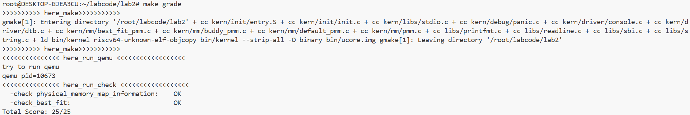
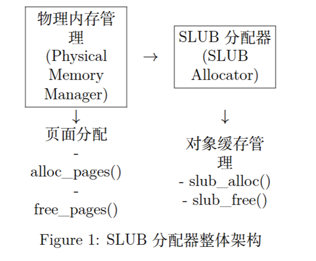
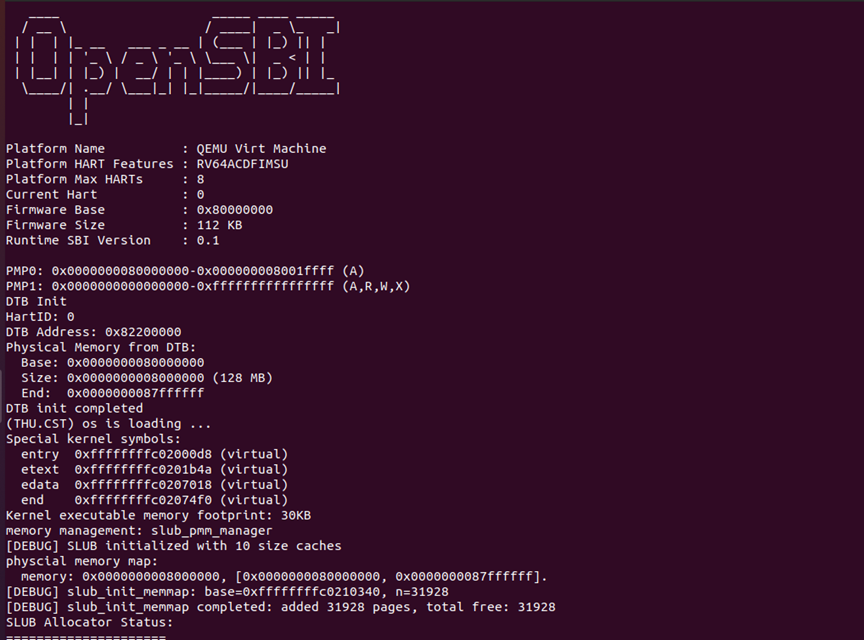
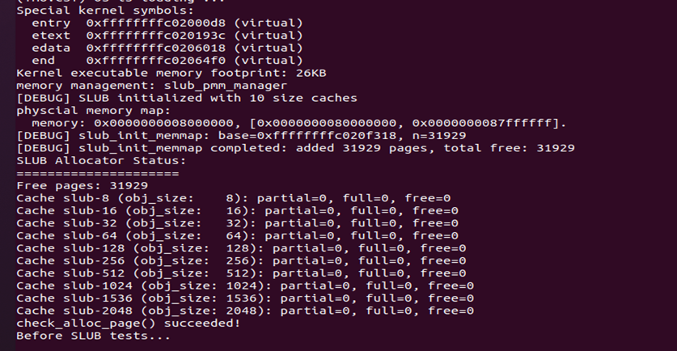

# 操作系统第二次实验

杨博涵 张耕嘉 刘嘉昊

## 练习1：理解first-fit 连续物理内存分配算法

> first-fit 连续物理内存分配算法作为物理内存分配一个很基础的方法，需要同学们理解它的实现过程。请大家仔细阅读实验手册的教程并结合`kern/mm/default_pmm.c`中的相关代码，认真分析default_init，default_init_memmap，default_alloc_pages， default_free_pages等相关函数，并描述程序在进行物理内存分配的过程以及各个函数的作用。 请在实验报告中简要说明你的设计实现过程。请回答如下问题：
>
> - 你的first fit算法是否有进一步的改进空间？

### first-fit 连续物理内存分配算法实现过程

在操作系统的内存管理中，物理内存的分配与回收是核心任务之一。为了有效管理内存，常用的内存分配算法之一是 **First Fit** 算法。该算法通过遍历空闲内存块链表，找到第一个适合请求大小的内存块进行分配。当内存被释放时，First Fit算法会将其重新加入链表并尝试合并相邻的空闲内存块，从而减少内存碎片。

1. 初始化空闲内存块链表
   在操作系统启动时，内存管理器会将所有可用的空闲内存页块加入一个链表中，这个链表称为空闲内存块链表。此时，系统的所有内存页块都标记为空闲状态，准备分配给各个进程使用。

2. 内存分配
   当进程需要分配一定大小的内存时，First Fit算法会从空闲内存块链表的头部开始遍历。对于每个空闲页块，算法检查其大小是否大于等于请求的内存大小。如果找到了足够大的内存块，分配该内存块给进程使用。若该内存块比请求的内存大，系统会将其分割成适合的大小，剩余部分重新加入到空闲链表中。

3. 内存释放

   当进程使用完分配的内存后，需要将内存释放回来。释放时，First Fit算法会将内存页块重新插入空闲内存块链表。若释放的内存块与前一个或后一个空闲内存块相邻，算法会将这些空闲块合并成一个更大的内存块，以减少内存碎片，提高内存使用效率。

   

### 各个函数作用

1. **`default_init`**
   - 功能：初始化空闲内存块链表（`free_list`）和空闲内存块计数器（`nr_free`）。其中：**`list_init(&free_list)`**: 初始化一个空的双向链表，用于管理自由内存块。**`nr_free = 0`**: 将空闲内存块的数量初始化为0，准备后续进行内存分配。
2. **`default_init_memmap`**
   - 功能：初始化指定范围内的内存块，并将其添加到自由内存列表。该函数遍历指定范围内的每个页面，初始化其标志和属性，将其标记为空闲状态（`flags` 和 `property` 设置为0）。同时，它将页面的引用计数设置为0，表示该页面未被引用。然后，设置第一个页面的 `property` 为内存块的大小（`n`），并将该内存块插入到空闲内存块链表中，保持链表有序。
3. **`default_alloc_pages`**
   - 功能：按照First-Fit算法为请求分配连续的内存页。
4. **`default_free_pages`**
   - 功能：释放已分配的内存并将其重新加入到自由内存列表，同时尝试合并相邻的自由内存块。
5. **`default_nr_free_pages`**
   - 功能：返回当前系统中空闲内存页的总数。
6. **`basic_check`**
   - 功能：执行一系列基本测试，验证内存分配和释放的基本功能。
7. **`default_check`**
   - 功能：执行详细的测试，验证First-Fit内存分配算法的正确性，并确保空闲内存块链表状态的正确性。

### 改进空间

**First-Fit 算法** 在内存分配中，虽然实现简单且高效，但在处理大规模内存分配时，存在一些时空复杂度上的问题。以下是几个关键的改进空间，主要涉及 **时间复杂度** 和 **空间复杂度** 的优化：

1. **时间复杂度优化：减少遍历空闲链表的时间**

   - **问题**：First-Fit 算法每次内存分配时都需要遍历整个空闲链表，查找第一个足够大的内存块。由于空闲链表是线性结构，这导致每次分配的时间复杂度为 **O(n)**，其中 **n** 是空闲块的数量。

   - **改进方案**：
     - **使用堆（Heap）**：可以通过使用 **堆**（如最小堆）来管理空闲内存块。堆的查找时间为 **O(log n)**，比线性查找更高效。这样每次分配时可以更快地找到合适的块。
     - **平衡二叉树（Balanced Binary Tree）**：类似于堆，平衡二叉树（如 AVL 树或红黑树）也可以有效地管理空闲内存块。通过将内存块按大小排序，查找时间可从 **O(n)** 优化到 **O(log n)**。
     - **分层链表**：可以将空闲内存块分成多个大小不同的区间，每个区间使用独立的链表。查找时，只需要检查合适区间内的链表，减少每次查找时的比较次数。

2. **空间复杂度优化：减少内存开销**

   - **问题**：在 First-Fit 算法中，每次分配和释放内存时，需要操作和维护整个空闲链表。随着空闲内存块的增加，链表可能会变得非常大，这会带来 **空间开销**，尤其是在内存碎片较多时。

   - **改进方案**：
     - **内存池管理（Memory Pool）**：使用内存池管理内存分配，预分配一块大的内存区域，将其划分为多个小块。对于不同大小的请求，可以从不同的内存池中分配，从而减少空闲链表的大小和管理的复杂度。
     - **分级管理（Buddy System 或 Slab Allocation）**：使用 **Buddy 系统** 或 **Slab 分配器**，按不同的大小将内存划分成块，每次只处理一个特定大小的内存块。这减少了链表节点的数量，并且分配和释放时更高效。
     - **合并空闲块**：定期合并相邻的空闲内存块，减少空闲链表中的节点数。这可以减少碎片，优化内存空间的管理。

3. **改进空闲块选择策略：减少不必要的分配和释放**

   - **问题**：在 First-Fit 算法中，每次分配时总是选择第一个符合条件的空闲块，这可能导致多个小空闲块分散在内存中，造成内存碎片。如果空闲块的大小分布不均匀，可能导致系统效率低下。

   - **改进方案**：
     - **Best-Fit 结合**：为了减少内存碎片，First-Fit 可以结合 **Best-Fit** 策略，选择最适合的块而不是第一个合适的块。尽管 Best-Fit 的时间复杂度较高，但可以减少剩余碎片的大小，长期来看有助于减少内存碎片。
     - **延迟分配（Lazy Allocation）**：通过推迟内存分配操作，等到系统有更多空闲内存时再进行分配。这可以减少小块内存的频繁分配和释放，降低内存碎片化的程度。

4. **无锁数据结构：提升并发性能**

   - **问题**：在多核或多线程环境下，多个线程可能同时访问和修改空闲链表，导致锁竞争，影响性能。

   - **改进方案**：
     - **无锁数据结构**：可以使用 **无锁链表** 或 **无锁堆** 来管理空闲内存块，从而减少并发时的锁竞争。这样可以在多线程环境中提高内存分配和释放的效率。
     - **线程局部存储（TLS）**：为每个线程维护一个本地的空闲链表，避免多个线程访问同一个全局链表，减少锁竞争，提高并发性能。

## 练习2：实现 Best-Fit 连续物理内存分配算法

>在完成练习一后，参考kern/mm/default_pmm.c对First Fit算法的实现，编程实现Best Fit页面分配算法，算法的时空复杂度不做要求，能通过测试即可。 请在实验报告中简要说明你的设计实现过程，阐述代码是如何对物理内存进行分配和释放，并回答如下问题：
>
>- 你的 Best-Fit 算法是否有进一步的改进空间？

### Best-Fit 算法原理

Best-Fit 是一种内存分配算法，它的核心思想是在空闲内存块中选择 **最小且足够大的** 内存块来满足请求。这意味着，当有多个内存块都能够满足分配需求时，算法会选择 **最适合的块**，即选择空间刚好足够且最小的空闲块。如果选择的内存块比所需空间大很多，则会将剩余的空间重新作为空闲内存块放回空闲链表中。

- **优点**：避免了过多的内存碎片，因为分配的内存块尽可能贴近请求的大小。
- **缺点**：由于需要遍历整个空闲链表来找到最合适的块，Best-Fit 的性能相对较差，特别是在内存碎片较多时。

### 实现细节

在这个实验中，我们使用 Best-Fit 算法来管理物理内存。以下是实现该算法的关键步骤和代码说明：

#### 初始化内存管理器

首先，我们需要初始化内存管理器。在 `best_fit_init` 函数中，我们初始化了一个空闲链表 `free_list`，并将空闲内存块的数量 `nr_free` 设置为 0。

```c
static void best_fit_init(void) {
    list_init(&free_list);  // 初始化空闲链表
    nr_free = 0;            // 初始化空闲块数量为 0
}
```

#### 初始化内存映射

在 `best_fit_init_memmap` 中，我们为物理内存页分配标志和引用计数，并根据需要将内存页插入到空闲链表中。每个内存页的 `flags` 被清零，`ref` 被设置为 0，表示内存页是空闲的。

```c
static void best_fit_init_memmap(struct Page *base, size_t n) {
    assert(n > 0);
    struct Page *p = base;
    for (; p != base + n; p++) {
        assert(PageReserved(p));
        p->flags = 0;  // 清空当前页框的标志
        p->ref = 0;    // 设置引用计数为 0
    }
    base->property = n;  // 设置块的大小
    SetPageProperty(base);  // 标记块为有效
    nr_free += n;  // 增加空闲块数量
```

`flags` 通常用于标记页面的状态，表示该页面是否处于某种特殊状态。`ref` 是页面的 **引用计数**，用于跟踪页面被引用的次数。

接着，我们根据 `base` 页的地址将其插入到空闲链表中。我们使用了链表的插入操作，确保空闲内存块按照地址从小到大的顺序排列。

```c
    if (list_empty(&free_list)) {
        list_add(&free_list, &(base->page_link));  // 如果空闲链表为空，直接插入
    } else {
        list_entry_t *le = &free_list;
        while ((le = list_next(le)) != &free_list) {
            struct Page *page = le2page(le, page_link);
            if (base < page) {
                list_add_before(le, &(base->page_link));  // 将 base 插入到第一个大于 base 的位置
                break;
            } else if (list_next(le) == &free_list) {
                list_add(le, &(base->page_link));  // 到达链表尾部，插入到尾部
            }
        }
    }
}
```

#### 内存分配

在 `best_fit_alloc_pages` 中，我们使用 Best-Fit 策略来分配内存。我们遍历空闲链表，查找第一个合适的内存块，并选择最小的符合要求的块。如果找到的块大于请求的大小，我们会将剩余的部分分配回空闲链表。

```c
static struct Page *best_fit_alloc_pages(size_t n) {
    assert(n > 0);
    if (n > nr_free) {
        return NULL;  // 如果没有足够的空闲内存，返回 NULL
    }
    struct Page *page = NULL;
    list_entry_t *le = &free_list;
    size_t min_size = nr_free + 1;  // 初始化最小块的大小

    // 遍历空闲链表，查找最合适的空闲页框
    while ((le = list_next(le)) != &free_list) {
        struct Page *p = le2page(le, page_link);
        if (p->property >= n && p->property < min_size) {
            min_size = p->property;  // 更新最小块的大小
            page = p;  // 记录当前最合适的块
        }
    }

    if (page != NULL) {
        list_entry_t *prev = list_prev(&(page->page_link));  // 找到该块前一个块的位置
        list_del(&(page->page_link));  // 从空闲链表中删除已选中的块

        if (page->property > n) {  // 如果找到的块比请求的块大，则分割该块
            struct Page *p = page + n;
            p->property = page->property - n;  // 更新剩余块的大小
            SetPageProperty(p);  // 标记剩余块为有效页
            list_add(prev, &(p->page_link));  // 将剩余块插入到空闲链表中
        }

        nr_free -= n;  // 更新空闲块数量
        ClearPageProperty(page);  // 将已分配的块标记为已分配
    }

    return page;  // 返回分配的页面
}
```

#### 内存释放

在 `best_fit_free_pages` 中，我们将已释放的页面插回到空闲链表，并尝试合并相邻的空闲块。通过判断前后的空闲块是否连续，我们将它们合并成一个更大的空闲块。

```c
static void best_fit_free_pages(struct Page *base, size_t n) {
    assert(n > 0);
    struct Page *p = base;
    for (; p != base + n; p++) {
        assert(!PageReserved(p) && !PageProperty(p));
        p->flags = 0;  // 清空页的标志
        set_page_ref(p, 0);  // 设置引用计数为 0
    }

    base->property = n;  // 设置当前块的属性为释放的页块数
    SetPageProperty(base);  // 标记为有效页块
    nr_free += n;  // 增加空闲块的数量

    if (list_empty(&free_list)) {
        list_add(&free_list, &(base->page_link));  // 如果空闲链表为空，直接插入
    } else {
        list_entry_t *le = &free_list;
        while ((le = list_next(le)) != &free_list) {
            struct Page *page = le2page(le, page_link);
            if (base < page) {
                list_add_before(le, &(base->page_link));  // 插入到合适位置
                break;
            } else if (list_next(le) == &free_list) {
                list_add(le, &(base->page_link));  // 到达链表尾部，插入到尾部
            }
        }
    }

    list_entry_t *le = list_prev(&(base->page_link));
    if (le != &free_list) {
        p = le2page(le, page_link);
        if (base == p + p->property) {
            p->property += base->property;  // 合并前后的空闲块
            ClearPageProperty(base);  // 清除当前块的属性标记
            list_del(&(base->page_link));  // 从链表中删除当前块
            base = p;  // 更新指针
        }
    }

    le = list_next(&(base->page_link));
    if (le != &free_list) {
        p = le2page(le, page_link);
        if (base + base->property == p) {
            base->property += p->property;  // 合并前后的空闲块
            ClearPageProperty(p);
            list_del(&(p->page_link));  // 删除合并的块
        }
    }
}
```

### 改进空间

尽管 Best-Fit 算法能够优化内存分配，减少大块空闲内存的浪费，但在时空复杂度方面，仍有一些改进空间：

1. **时间复杂度优化**：
   - **问题**：每次分配内存时，需要遍历整个空闲链表，查找最适合的内存块，时间复杂度为 **O(n)**，其中 **n** 是空闲块的数量。
   - **改进方案**：
     - 使用 **堆** 或 **平衡二叉树** 来管理空闲块，将查找最适合的块的时间从 **O(n)** 降低到 **O(log n)**。这样可以显著提高大规模内存分配的效率。
     - 使用 **分层链表** 或 **空闲区间合并**，将内存块按照大小分组，减少每次查找时需要遍历的内存块数量。
2. **空间复杂度优化**：
   - **问题**：Best-Fit 算法需要维护整个空闲链表，随着内存碎片的增多，链表可能变得非常庞大。
   - **改进方案**：
     - 通过 **内存池**（memory pool）管理空闲块，将空闲块按不同大小分配到不同的内存池中。这样可以减少每次分配时遍历整个空闲链表的空间开销。
     - **合并小块**：定期合并相邻的空闲块，以减少碎片化，从而降低链表的大小，减少存储开销。

## 扩展练习Challenge：buddy system（伙伴系统）分配算法

>Buddy System算法把系统中的可用存储空间划分为存储块(Block)来进行管理, 每个存储块的大小必须是2的n次幂(Pow(2, n)), 即1, 2, 4, 8, 16, 32, 64, 128...
>
>- 参考[伙伴分配器的一个极简实现](http://coolshell.cn/articles/10427.html)， 在ucore中实现buddy system分配算法，要求有比较充分的测试用例说明实现的正确性，需要有设计文档。

### Buddy System 原理

Buddy System 是一种内存分配算法，它将内存分割成大小为 2 的幂次方的块，并根据需要分配合适的内存块。其核心思想是，每次分配或释放内存时，都会将内存块按照大小进行对齐，并且会根据块的大小合并相邻的空闲块，形成更大的空闲块。Buddy System 的优点是能够高效管理内存，减少碎片，且释放内存时可以快速合并相邻的块。

#### 基本操作

1. **初始化：** 内存管理区初始化后，所有的页面会被按照 2 的幂次方大小分成不同的空闲链表，并且每个块的大小是连续的。
2. **内存分配：** 当请求分配内存时，Buddy System 会从合适的空闲链表中选取一个大小足够的块。如果该块太大，则会将其拆分为两个“伙伴”块，直到合适的块大小被找到。
3. **内存释放：** 当释放内存时，Buddy System 会将释放的块与相邻的伙伴块进行合并，形成更大的空闲块。如果合并后还有更大的空闲块，则继续合并，直到无法合并为止。

### 设计说明

#### 整体架构与关键结构

Buddy System 的核心设计在于将内存划分为多个大小为 2 的幂次方的块，并使用 `buddy_area_t` 结构体来管理这些块。该结构体中包含了多个关键字段：

- **free_list:** 这是一个数组，存储每个阶次（`BUDDY_MAX_ORDER`）的空闲块链表，每个阶次表示一个特定大小的内存块。
- **nr_free:** 用于记录当前空闲块的总数，确保在内存分配和释放过程中对空闲内存的准确追踪。
- **base 和 npages:** `base` 是 Buddy 系统所管理的内存的起始地址，`npages` 是管理的总页数。

#### **初始化过程**

初始化时，调用`buddy_init_memmap` 函数，来设置和初始化 Buddy 系统的内存。其核心步骤如下：

1. **清理页面标志：** 通过循环遍历整个管理区间，将所有页面的标志位清除，并初始化为“空闲”状态。代码：

   ```
   for (struct Page *p = base; p != base + n; p++) {
       assert(PageReserved(p));
       p->flags = 0;
       p->property = 0;
       set_page_ref(p, 0);
       ClearPageReserved(p);
   }
   ```

2. **分割内存块：** 将内存分割成符合 Buddy 系统对齐规则的块。通过按阶数从大到小分割，每次分割都会确保内存块满足对齐要求，并将这些块插入到合适的空闲链表中。代码：

   ```
   size_t offset = 0;  // 相对 base 的页索引
   size_t rem = n;
   while (rem > 0) {
       size_t size = 1;
       unsigned order = 0;
       while ((order + 1) <= BUDDY_MAX_ORDER && (size << 1) <= rem && ((offset % (size << 1)) == 0)) {
           size <<= 1;
           order++;
       }
       struct Page *p = base + offset;
       p->property = size;
       SetPageProperty(p);
       list_add(&FL(order), &(p->page_link));
       NR_FREE += size;
       offset += size;
       rem -= size;
   }
   ```

#### **内存分配**

`buddy_alloc_pages` 函数负责从空闲链表中分配内存，并且支持内存块的拆分。如果空闲链表中的块不满足需求，它会通过拆分较大的块来满足请求。关键步骤如下：

1. **查找合适的阶数：** 通过 `size2order_ceil` 函数计算请求内存的最小阶数，并从对应的空闲链表中查找可用的内存块。代码：

   ```
   unsigned need_order = size2order_ceil(n);
   unsigned got_order = need_order;
   while (got_order <= BUDDY_MAX_ORDER && list_empty(&FL(got_order))) {
       got_order++;
   }
   ```

2. **拆分大块：** 如果找到的块比需求大，使用 `insert_and_merge` 函数将块拆分成适合的大小，并向下二分，直到满足需求。代码：

   ```
   struct Page *blk = le2page(le, page_link);
   list_del(le);
   ClearPageProperty(blk);
   size_t cur_size = order2size(got_order);
   while (got_order > need_order) {
       got_order--;
       cur_size >>= 1;
       struct Page *right = blk + cur_size;
       right->property = cur_size;
       SetPageProperty(right);
       list_add(&FL(got_order), &(right->page_link));
   }
   ```

3. **标记已分配内存：** 最后，标记分配的块为“已分配”，并将相关标志和引用计数更新。代码：

   ```
   blk->property = alloc_size;
   for (size_t i = 0; i < alloc_size; i++) {
       struct Page *pg = blk + i;
       ClearPageProperty(pg);
       SetPageReserved(pg);
       set_page_ref(pg, 0);
   }
   ```

#### **内存释放**

`buddy_free_pages` 函数负责释放内存并将其合并到空闲链表中。其核心流程包括：

1. **查找对应的块大小：** 根据分配时记录的块大小，确认要释放的内存块大小。代码：

   ```
   size_t alloc_size = base->property;
   if (alloc_size == 0) {
       assert((n & (n - 1)) == 0);  // n 是 2^k
       alloc_size = n;
   }
   ```

2. **合并相邻的空闲块：** 使用 `insert_and_merge` 函数合并相邻的空闲块，直到无法再合并。代码：

   ```
   insert_and_merge(base, order);
   NR_FREE += alloc_size;
   ```

#### **自检与一致性检查**

为了确保系统的正确性，`buddy_check` 函数执行了包括分配、释放以及合并在内的多种操作。它会分配不同大小的块并释放，最终检查空闲页总数是否一致。代码：

```
buddy_check() {
    size_t before = buddy_nr_free_pages();
    struct Page *a = alloc_pages(1);
    free_pages(a, 1);
    assert(buddy_nr_free_pages() == before);
}
```

### 测试样例说明

为了验证 Buddy System 的正确性，进行了一些简单的分配与释放操作，确保内存管理过程中的空闲页面数目得到正确的恢复。主要测试了以下场景：

1. **分配与释放：** 分配并释放了不同大小的内存块（如 1 页、2 页、3 页、5 页、6 页等），每次释放后都检查空闲页数是否恢复到初始状态。
2. **块的拆分与合并：** 分配一个较大的块后，系统自动拆分成较小的块，再将多个小块合并成大块，确保内存管理过程中的合并与拆分操作正常执行。
3. **内存合并测试：** 在释放小块内存后，系统会自动合并相邻的空闲块，并且检查合并后的空闲链表是否正确。

通过这些测试，确认了 Buddy System 能够正确管理内存，分配和释放操作均符合预期，且内存碎片得到了有效控制。

使用相似的代码修改`grade.sh`文件，完成对buddy system的测试

```shell
pts=5
quick_check 'check physical_memory_map_information'                                         \
    'memory management: buddy_pmm_manager'                     \
    '  memory: 0x0000000008000000, [0x0000000080000000, 0x0000000087ffffff].'                                  \

pts=20
quick_check 'check_buddy_system'                                       \
    'check_alloc_page() succeeded!'                                  \
    'satp virtual address: 0xffffffffc0204000'                       \
    'satp physical address: 0x0000000080204000'                      \
```

测试结果如图所示



## 任意大小的内存单元slub分配算法

>slub算法，实现两层架构的高效内存单元分配，第一层是基于页大小的内存分配，第二层是在第一层基础上实现基于任意大小的内存分配。可简化实现，能够体现其主体思想即可。
>
>- 参考[linux的slub分配算法/](https://github.com/torvalds/linux/blob/master/mm/slub.c)，在ucore中实现slub分配算法。要求有比较充分的测试用例说明实现的正确性，需要有设计文档。

SLUB 分配器基于 “对象缓存” 和 “分层管理” 的核心原理，构建了一套高效的内存分配体系。在具体实现上，SLUB 采用两层架构：第一层从物理内存分配器获取完整页面，第二层将这些页面划分为统一尺寸的对象缓存。系统为常用内存尺寸预先建立专用缓存，每个缓存通过三个精确定义的链表管理不同使用状态的 slab—— 完全空闲的 slab（free）、部分使用的 slab（partial）和完全占用的 slab（full）。

当内存分配请求到达时，SLUB 首先匹配对应尺寸的缓存，优先从 partial 链表中分配对象以最大化利用现有资源；若无可用 partial slab 则转向 free 链表；仅当所有现有资源耗尽时才申请新的物理页面。这种状态机式的动态管理确保了内存的高效流转：新页面初始位于 free 链表，随着对象分配进入 partial 链表，完全占用后移至 full 链表，而对象释放时又根据实际情况回归 partial 或 free 链表。

这种设计不仅大幅减少了直接调用底层页面分配器的开销，更重要的是通过尺寸标准化和状态精细化管控，在保证分配速度的同时最大限度地减少了内存碎片，特别契合操作系统内核频繁进行小对象分配释放的高性能需求场景。

### 核心特性

- 多尺寸对象缓存：支持 8B-2048B 的多种对象尺寸
- 三级 slab 管理策略：free、partial、full 三级链表管理
- 高效的内存利用率：通过对象缓存减少内存碎片
- 调试和状态检查功能：完整的运行状态监控机制

### 架构设计

#### 整体架构



#### 缓存结构设计

SLUB 分配器的核心数据结构是 `slub_cache_t`，用于管理特定尺寸的对象缓存。

```c
typedef struct slub_cache {
    char name[16]; // 缓存名称
    size_t object_size; // 对象大小
    size_t object_real_size; // 实际对象大小(含元数据)
    unsigned int objects_per_slab; // 每个slab的对象数量

    // 三级管理链表
    list_entry_t partial_slabs; // 部分使用的slab
    list_entry_t full_slabs; // 完全使用的slab
    list_entry_t free_slabs; // 完全空闲的slab

    unsigned int nr_partial; // 统计信息
    unsigned int nr_full;
    unsigned int nr_free;
} slub_cache_t;
```

#### 全局分配器结构

全局分配器管理所有尺寸缓存和统计信息

```c
typedef struct slub_allocator {
    bool initialized; // 初始化标志
    slub_cache_t size_caches[SLUB_SIZE_NUM]; // 尺寸缓存数组
    unsigned long total_allocated; // 总分配统计
    unsigned long total_freed; // 总释放统计
} slub_allocator_t;
```

### 核心算法实现

#### 初始化算法

SLUB 分配器在初始化阶段预定义 10 种标准对象尺寸，并为每种尺寸创建对应的缓存，具体实现代码如下

```c
static const size_t slub_sizes[SLUB_SIZE_NUM] = {8, 16, 32, 64, 128, 256, 512, 1024, 1536, 2048}; // 预定义的缓存尺寸

void slub_init(void) {
    for (int i = 0; i < SLUB_SIZE_NUM; i++) {
        slub_cache_t *cache = &slub_allocator.size_caches[i];
        cache->object_size = slub_sizes[i]; // 设置缓存属性
        cache->object_real_size = slub_sizes[i] + SLUB_METADATA_SIZE; // 实际对象大小
        cache->objects_per_slab = (PAGE_SIZE - sizeof(slub_page_t)) / cache->object_real_size; // 每个 slab 可容纳的对象数量

        // 初始化管理链表
        list_init(&cache->partial_slabs);
        list_init(&cache->full_slabs);
        list_init(&cache->free_slabs);
    }
    slub_allocator.initialized = true;
}
```

#### 三级状态管理算法

SLUB 的核心创新在于其精细的三级 slab 状态管理体系：

- 空闲 slab 链表（free）：包含完全未使用的内存页面
- 部分使用 slab 链表（partial）：管理既有空闲对象又有已分配对象的页面
- 完全使用 slab 链表（full）：追踪所有对象都被分配出去的页面

#### 分配与释放状态机

1. **分配路径**
   - 优先从当前 CPU 的本地缓存分配（最快路径）
   - 本地缓存耗尽时转向部分使用 slab 链表
   - 部分使用链表也耗尽时从空闲 slab 链表分配
   - 最后才申请新的物理页面
2. **释放路径**
   - 对象被释放回对应的 slab
   - 根据 slab 使用状态动态调整其所在链表
   - 完全空闲的 slab 可能被保留或返还给系统

### 状态检查实现

基于 `slub_check()` 函数实现详细的状态监控机制。

```c
void slub_detailed_check(void) {
    slub_check(); // 基础状态检查
    // 详细统计信息
    cprintf("\nDetailed Statistics:\n");
    cprintf("Total allocated: %lu\n", slub_allocator.total_allocated);
    cprintf("Total freed: %lu\n", slub_allocator.total_freed);
    cprintf("Memory in use: %lu bytes\n", slub_allocator.total_allocated - slub_allocator.total_freed);
    // 各缓存详细状态
    for (int i = 0; i < SLUB_SIZE_NUM; i++) {
        slub_cache_t *cache = &slub_allocator.size_caches[i];
        cprintf("Cache %s: objects_per_slab=%d, real_size=%d\n", cache->name, cache->objects_per_slab , cache->object_real_size);
    }
}
```

### 运行结果分析

#### 内核加载与符号解析

运行结果显示内核成功加载：



```
Special kernel symbols: entry 0xffffffffc02000d8 (virtual) etext 0xffffffffc0201b4a (virtual)
edata 0xffffffffc0207018 (virtual)
end 0xffffffffc02074f0 (virtual)
Kernel executable memory footprint: 30KB
```

关键分析：

- 内核入口点、代码段、数据段虚拟地址映射正确建立
- 内核内存占用仅 30KB，SLUB 分配器开销控制在合理范围
- 虚拟地址空间布局符合预期，为内存分配提供正确基础

#### SLUB 分配器初始化

```
memory management: slub_pmm_manager
[DEBUG] SLUB initialized with 10 size caches
```

验证结果：

- 成功注册 SLUB 作为系统内存管理器
- 10 个尺寸缓存（8B-2048B）预分配完成
- 缓存系统为高效对象分配奠定结构性基础

#### 物理内存映射集成

```
physcial memory map: 
memory: 0x0000000008000000, [0x0000000080000000, 0x0000000087ffffff].
[DEBUG] slub_init_memmap: base=0xffffffffc0210340, n=31928 
[DEBUG] slub_init_memmap completed: added 31928 pages, total free: 31928
```

**关键发现**

* 系统识别出 31,928 个可用物理页面（128MB/4KB）

* 初始空闲页面计数准确反映系统启动状态

* SLUB 与物理页面管理器集成成功

#### 三级链表状态验证

SLUB 分配器初始状态信息如下：

```
SLUB Allocator Status:
Free pages: 31928
Cache slub-8 (obj_size: 8): partial=0, full=0, free=0
Cache slub-16 (obj_size: 16): partial=0, full=0, free=0
......
```

状态分析：

- `Free pages` 计数与物理内存映射完全一致
- 所有缓存初始状态为 `partial=0, full=0, free=0`
- 系统启动时 SLUB 分配器处于“干净”状态
- 三级链表数据结构初始化正确

#### 分配算法验证

测试阶段内部工作机制日志如下：

```
=== SLUB Basic Function Test === 
[DEBUG] slub_alloc: 8 bytes
[DEBUG] cache index: 0 
[DEBUG] Using cache: slub-8, free_list: 0x0
[DEBUG] No free objects, allocating new slab
```

算法执行分析：

- 8 字节请求正确映射到 `slub-8` 缓存
- 检测到无空闲对象，触发新 slab 分配
- 符合 SLUB 状态机逻辑和分配优先级



## 扩展练习Challenge：硬件的可用物理内存范围的获取方法

> 如果 OS 无法提前知道当前硬件的可用物理内存范围，请问你有何办法让 OS 获取可用物理内存范围？

当 OS 事先不知道可用物理内存范围时，**正确做法不是去“探测”物理地址**，而是让固件/引导器把“内存地图”交给 OS。操作系统据此“净化”得到可分配区间，再交给物理页分配器.

### UEFI 方法

1. **BootServices.GetMemoryMap()**：拿到 EFI 内存段在 `ExitBootServices() `前获取并保存，进入内核后把 `EfiBootServices*` 类型段标记为可回收。（这类内存原先被固件的“开机服务”占着；一旦固件退场（`ExitBootServices` 之后），它就空出来了。所以进内核后，你要把这些 `EfiBootServicesCode`/`Data `之类标记成可用，加回到自己的物理页分配器里。）
   
2. **引导器负责**：
   - 在退出前调用 `GetMemoryMap()` 把“内存地图”存好（放在一小块自己分到的物理内存里）。
   - 调用 `ExitBootServices()` 让固件退场，并把内存地图的物理地址作为启动参数传给内核。

3. **内核负责**：
   - 读取内存地图，挑选出真正能用的内存（普通 RAM）。
   - 扣掉内核镜像、initrd 等占用区间，再把 `EfiBootServices*` 这类可回收区间加入空闲列表，后续即可正常分配。

4. **对获得的地图进行处理**：
   
   - **筛选可用内存类型**：  
   
     - 从 `GetMemoryMap()` 的 `EFI_MEMORY_DESCRIPTOR` 表中，加入候选的可用内存类型：  
     - `EfiConventionalMemory`  
     - 退出后可回收的：`EfiBootServicesCode/Data`、`EfiLoaderCode/Data`  
     - （可选）`EfiACPIReclaimMemory`：拷走 ACPI 表后再回收
   
     **不可用的内存类型**：  
   
     永远不能使用的类型包括：  
   
     - `EfiRuntimeServicesCode/Data`（Runtime 段）  
     - `EfiACPIMemoryNVS`  
     - `EfiMemoryMappedIO` / `EfiMemoryMappedIOPortSpace`  
     - `EfiReservedMemoryType`、`EfiUnusableMemory` 等
   - **排除不可用内存区间**：  
   
      - 把不能使用的物理地址区间从“候选可用内存区间”中扣除，具体包括：  
      - **固件保留**：把 `EfiRuntimeServices*`、`NVS` 等类型排除在外，不加入候选可用内存。  
      - **内核镜像**、早期页表、栈、早期分配器、`BootInfo`/内存地图拷贝区。  
      - **`Initrd`**：内核启动时所使用的临时内存区域。
   
   - **清洗并分区**：  
   
      - 按页大小对齐（4K、16K、64K，具体取决于你的内核配置）。  
      - 对内存区间进行**排序**，并**合并**相邻或重叠的区间，以避免内存碎片。  
      - **Zone 划分**（常见划分方法）：  
        - 小于 4 GB 的内存区间 → `ZONE_DMA32`（服务 32 位 DMA 设备）  
        - 大于或等于 4 GB 的内存区间 → `ZONE_NORMAL`  

### Device Tree（FDT）方法

FDT是一份只读的数据结构（一段内存里的二进制 blob，通常称 DTB），描述了平台硬件：CPU、内存、外设、保留区等。在开机时被固件（OpenSBI/U-Boot 等）放进内存，然后把它的地址放到寄存器 a1 传给内核。

`/memory` 节点告诉我们“RAM 在哪儿、有多大”；`memreserve` 和` /reserved-memory `告诉我们“这些地方别用”。

操作系统将“能用的”内存减去“别用的”内存，剩下的部分就是可分配的物理内存区间，然后交给物理页分配器（如 `first-fit`、`best-fit`、`buddy` 或 `slub`）进行管理。

具体来说，我们需要通过以下步骤来处理设备树（DTB）：

1. `/memory@…` 节点
   * device_type="memory" 的节点，属性 reg 是若干 (base, size) 对，表示 RAM 存在的物理范围（可能不止一段）。这就是“能用的大致边界”。

2. DTB 头部的 `memreserve` 表
   - 包含一堆 `(addr, size)` 对，告诉我们“这些物理区间被固件或镜像保留，不能用”。


3. `/reserved-memory` 子树
   - 子节点的 `reg` 是要保留的物理区间，常见标记包括：
     - `no-map`：不映射、不分配（必须扣除）。
     - `shared-dma-pool` / `linux,cma`：通常也需要先保留。
     - `reusable`：有的平台表示该区域后续可以回收，通常先按保留处理最安全。


4. `/chosen` 节点

   - `linux,initrd-start` / `linux,initrd-end`：表示 initrd 所在的物理区间；

   - 我们还可以把 `BootInfo` 放在某个物理区段，并把这段内存也从可分配内存中扣除。


5. 总结
   - 只有 `device_type="memory"` 的 `/memory@*` 节点代表真正的“RAM”，其它节点的 `reg` 都是设备的 MMIO，不能当作内存使用。


#### 地图处理步骤

1) **收集候选的 RAM 段**  
   - 只查看 `device_type="memory"` 的 `/memory@*` 节点，解析其 `reg` 属性得到若干 `(base, size)`。
   - 使用根节点的 `#address-cells` 和 `#size-cells` 来解析 64 位数（大端 cell 拼接为 64 位）。

2) **扣除不可用的物理地址区间**  
   - 从“候选可用内存区间”中扣除不能用的物理地址区间（做减法）。
   - `memreserve` 表：全局保留清单，包含若干 `(addr, size)`，无条件扣除。
   - `/reserved-memory` 子树：逐个读取子节点的 `reg` 段，这些区域默认需要从候选的 RAM 中扣除。
   - 内核镜像、页表、堆栈、`BootInfo`、DTB 自身：这些都占用物理内存，也需要从可分配区间中扣除。
   - `/chosen` 中的 `linux,initrd-start` 和 `linux,initrd-end`：把 initrd 物理区间扣掉。

3) **清洗与分区**  
   - 按照与 UEFI 方法相同的方式对内存区间进行清洗和分区。

综上所述，按照“加候选 → 三类减法 → 清洗分区”的流程，最终得到的就是可安全分配的物理页范围。

### 总结

通过上述 UEFI 或 FDT 方法，操作系统可以准确地获取可用的物理内存范围，避免不必要的物理地址探测，并为物理页分配器提供合适的内存区间。这些方法确保了内存的高效管理和分配，特别适用于硬件平台的初始化阶段。