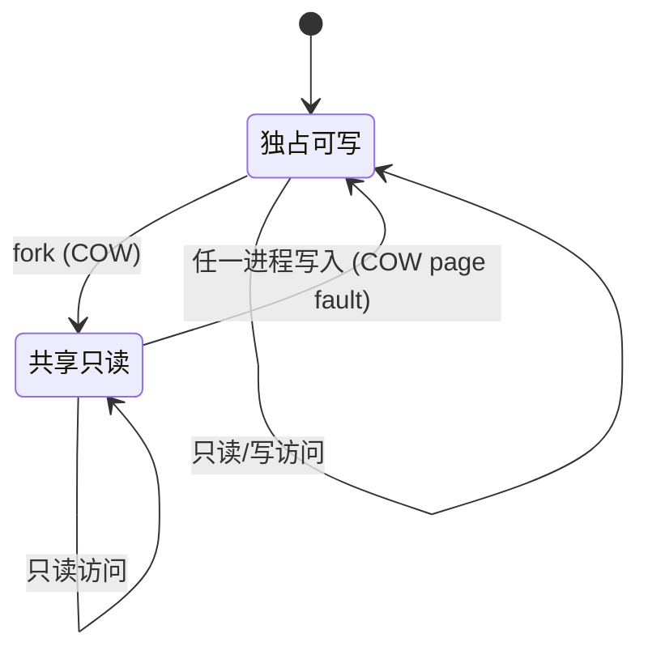
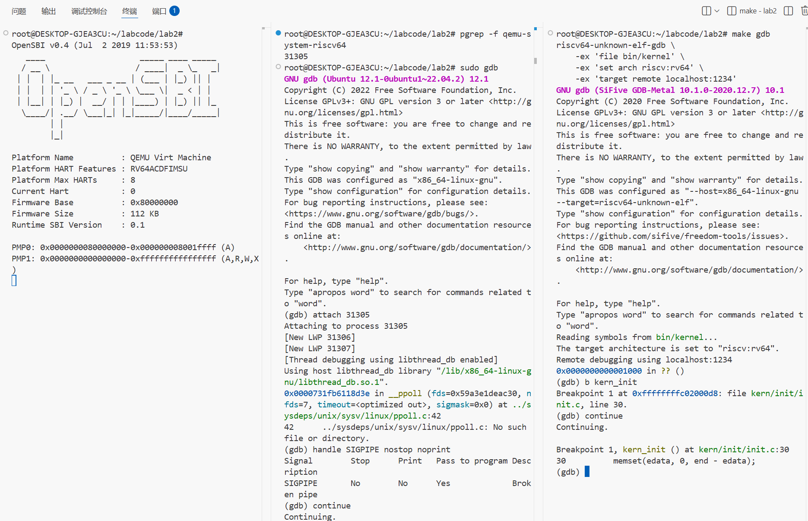
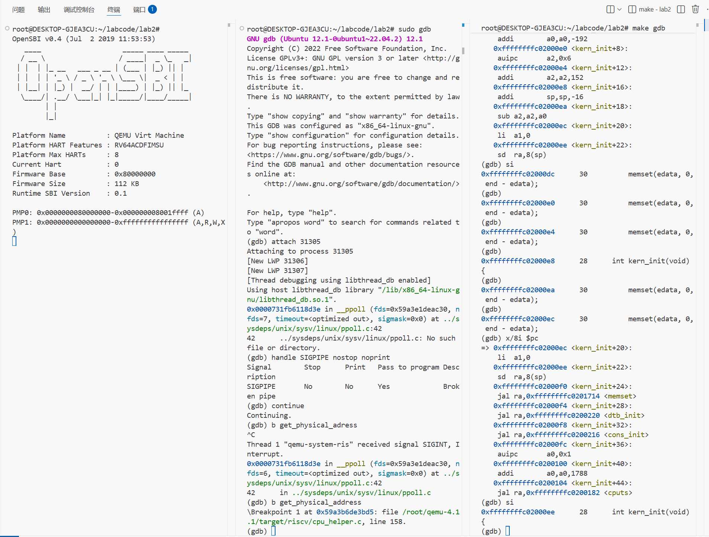
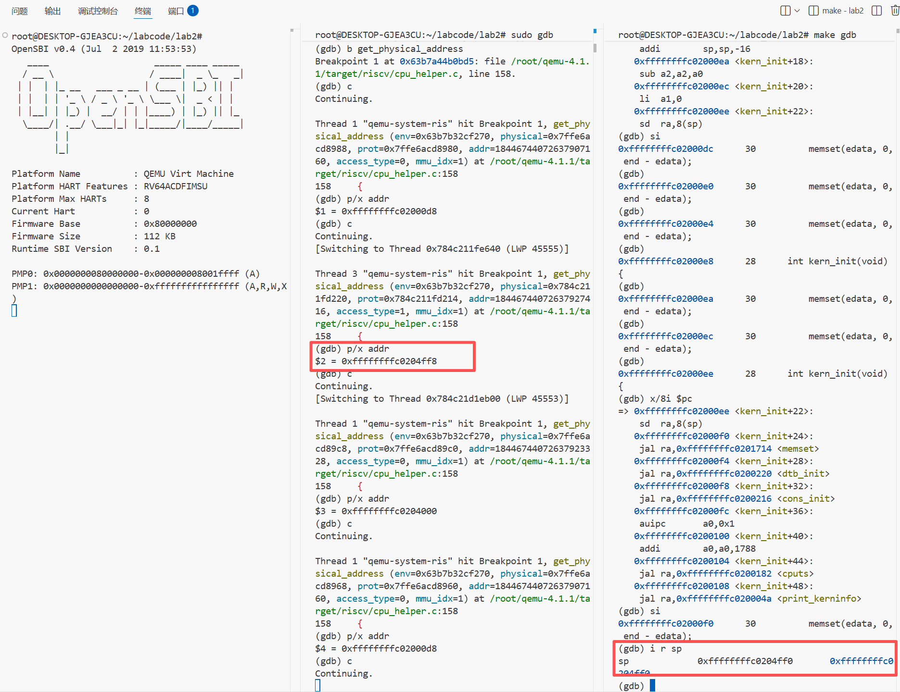
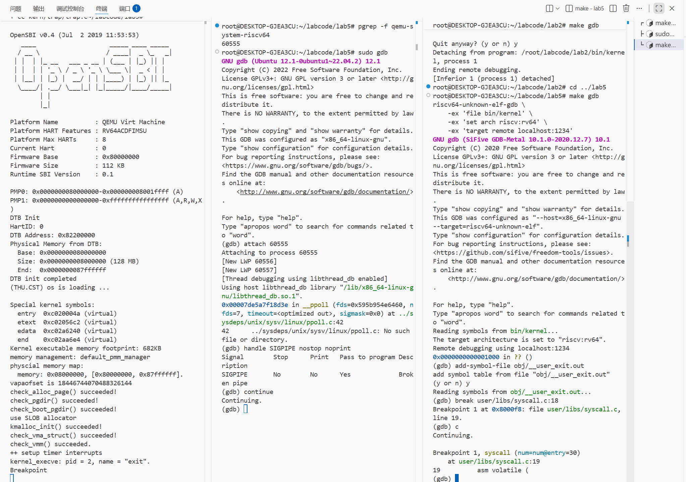
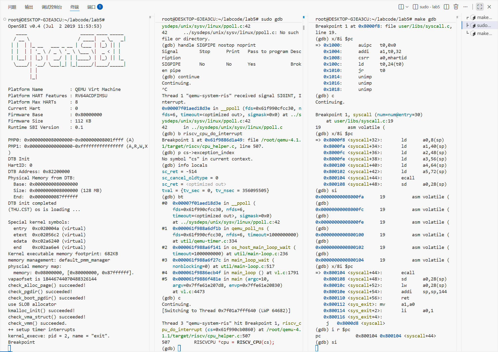
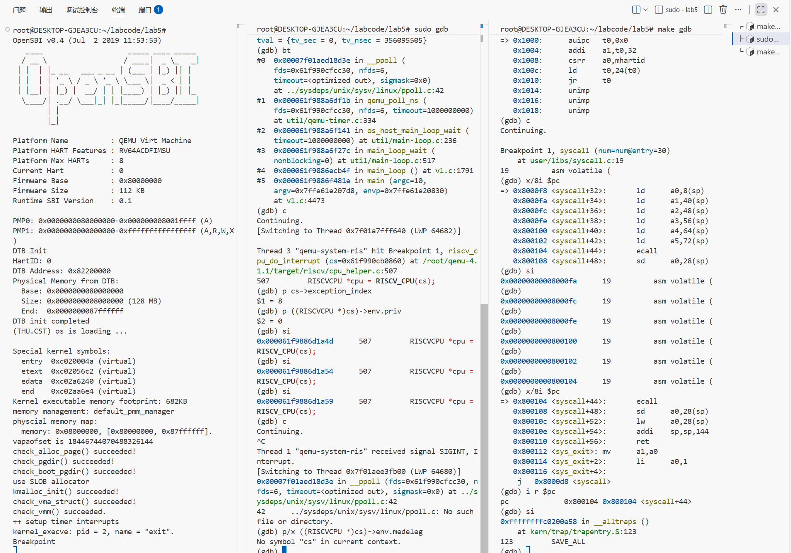

# 操作系统第五次实验

杨博涵 张耕嘉 刘嘉昊

## 练习0：填写已有实验

> 本实验依赖实验2/3/4。请把你做的实验2/3/4的代码填入本实验中代码中有“LAB2”/“LAB3”/“LAB4”的注释相应部分。注意：为了能够正确执行 `lab5` 的测试应用程序，可能需对已完成的实验2/3/4的代码进行进一步改进。

将lab3中`trap.c`补充的代码添加到lab5中，在此处需要修改，将中断改为标记当前进程需要重新调度。

```c
    case IRQ_S_TIMER:
        /* LAB5 GRADE   2313725 :  */
        /* 时间片轮转： 
        *(1) 设置下一次时钟中断（clock_set_next_event）
        *(2) ticks 计数器自增
        *(3) 每 TICK_NUM 次中断（如 100 次），进行判断当前是否有进程正在运行，如果有则标记该进程需要被重新调度（current->need_resched）
        */
        clock_set_next_event(); // (1) 设置下一次时钟中断
        ticks++; // (2) ticks 计数器自增
        if (ticks % TICK_NUM == 0) { // (3) 每 TICK_NUM 次中断
            print_ticks(); // 打印当前 ticks
            if (current != NULL) {
                current->need_resched = 1; // 标记当前进程需要重新调度
            }
        }
        break;
```

将lab4中补充的代码添加到lab5中

`alloc_proc`

```C
static struct proc_struct *
alloc_proc(void)
{
    struct proc_struct *proc = kmalloc(sizeof(struct proc_struct));
    if (proc != NULL)
    {
        proc->state = PROC_UNINIT;
        proc->pid = -1;
        proc->runs = 0;
        proc->kstack = 0;
        proc->need_resched = 0;
        proc->parent = NULL;
        proc->mm = NULL;
        memset(&(proc->context), 0, sizeof(struct context));
        proc->tf = NULL;
        // 使用内核页目录的物理地址
        proc->pgdir = boot_pgdir_pa;  // 这应该已经是物理地址
        proc->flags = 0;
        memset(proc->name, 0, PROC_NAME_LEN + 1);
        proc->wait_state = 0;
        proc->cptr = proc->yptr = proc->optr = NULL;
    }
    return proc;
}
```

这段代码相较于 Lab4，在 `proc_struct` 中新增了两个字段：

1. **`proc->wait_state = 0;`**
   - **作用**：表示进程的等待状态。用于记录进程是否在等待某些资源或事件。
   - **初始化为 `0`**，表示进程初始时不处于等待状态。
2. **`proc->cptr = proc->yptr = proc->optr = NULL;`**
   - **作用**：表示进程之间的关系。
     - **`cptr`**：指向子进程（child process）。
     - **`yptr`**：指向较年轻的兄弟进程（younger sibling）。
     - **`optr`**：指向较年长的兄弟进程（older sibling）。
   - **初始化为 `NULL`**，表示尚未建立这些关系。

`do_fork`

```c
int do_fork(uint32_t clone_flags, uintptr_t stack, struct trapframe *tf)
{
    int ret = -E_NO_FREE_PROC;
    struct proc_struct *proc;
    if (nr_process >= MAX_PROCESS)
    {
        goto fork_out;
    }
    ret = -E_NO_MEM;
    if ((proc = alloc_proc()) == NULL)
    {
        goto fork_out;
    }

    if (setup_kstack(proc) != 0)
    {
        goto bad_fork_cleanup_proc;
    }

    if (copy_mm(clone_flags, proc) != 0)
    {
        goto bad_fork_cleanup_kstack;
    }

    copy_thread(proc, stack, tf);

    bool intr_flag;
    local_intr_save(intr_flag);
    {
        proc->pid = get_pid();
        hash_proc(proc);

        // 只通过 set_links 把新进程挂到 proc_list，并维护关系/计数
        proc->parent = current;
        current->wait_state = 0;
        set_links(proc);
    }
    local_intr_restore(intr_flag);

    wakeup_proc(proc);

    ret = proc->pid;

fork_out:
    return ret;

bad_fork_cleanup_kstack:
    put_kstack(proc);
bad_fork_cleanup_proc:
    kfree(proc);
    goto fork_out;
}
```

1. **`proc->parent = current;`**

- **作用**：将新创建的进程的父进程指针 (`parent`) 设置为当前进程（`current`）。
- **解释**：`current` 代表正在调用 `do_fork` 的进程，即父进程。通过这行代码，子进程的 `parent` 字段指向了父进程。这样，在进程树中，父子进程之间的关系得到了明确的设置，方便后续进程管理和资源清理。

2. **`current->wait_state = 0;`**

- **作用**：将当前父进程的 `wait_state` 设置为 `0`。
- **解释**：`wait_state` 字段用于表示进程是否处于等待状态。如果父进程的 `wait_state` 设置为 `0`，表示父进程不再等待子进程的结束，或者准备继续执行其他任务。通常，这个字段用来管理进程的状态，特别是在进程等待子进程或其他事件时。

3. **`set_links(proc);`**

- **作用**：调用 `set_links` 函数将新进程 (`proc`) 插入到进程链表（`proc_list`）中，并维护进程之间的关系（如父子关系）。
- **解释**：`set_links` 的主要作用是将新进程添加到操作系统的进程管理结构中。进程管理通常会使用一个链表（如 `proc_list`）来维护所有活跃进程的列表。通过这个操作，新进程被添加到系统的进程列表中，操作系统可以追踪所有进程的状态。

`proc_run`则直接粘贴Lab4代码，不作修改。

## 练习1: 加载应用程序并执行（需要编码）

> **do_execve**函数调用`load_icode`（位于kern/process/proc.c中）来加载并解析一个处于内存中的ELF执行文件格式的应用程序。你需要补充`load_icode`的第6步，建立相应的用户内存空间来放置应用程序的代码段、数据段等，且要设置好`proc_struct`结构中的成员变量trapframe中的内容，确保在执行此进程后，能够从应用程序设定的起始执行地址开始执行。需设置正确的trapframe内容。
>
> 请在实验报告中简要说明你的设计实现过程。
>
> - 请简要描述这个用户态进程被ucore选择占用CPU执行（RUNNING态）到具体执行应用程序第一条指令的整个经过。

在`load_icode`函数末尾添加如下代码

```C
    tf->gpr.sp = USTACKTOP; // Set user stack top
    tf->epc = elf->e_entry; // Set entry point of user program
    tf->status = sstatus & ~SSTATUS_SPP; // Clear SPP to indicate user mode
    tf->status |= SSTATUS_SPIE; // Enable interrupts for user mode
```

1. **`tf->gpr.sp = USTACKTOP;`**
   - **含义**: 设置用户栈顶地址。
   - 作用:
     - 用户程序运行时需要一个栈，`USTACKTOP` 是用户栈的顶端地址。
     - 通过设置 `trapframe` 的 `sp`（栈指针），确保用户程序能够正确使用栈。
2. **`tf->epc = elf->e_entry;`**
   - **含义**: 设置用户程序的入口地址。
   - 作用:
     - `elf->e_entry` 是从 ELF 文件中读取的程序入口地址。
     - 通过设置 `trapframe` 的 `epc`（程序计数器），确保用户程序从正确的位置开始执行。
3. **`tf->status = sstatus & ~SSTATUS_SPP;`**
   - **含义**: 清除 `SSTATUS_SPP` 位，表示切换到用户态。
   - 作用:
     - `SSTATUS_SPP`（Supervisor Previous Privilege）位用于指示之前的特权级。
     - 清除该位，表示从内核态切换到用户态。
4. **`tf->status |= SSTATUS_SPIE;`**
   - **含义**: 设置 `SSTATUS_SPIE` 位，启用用户态中断。
   - 作用:
     - `SSTATUS_SPIE`（Supervisor Previous Interrupt Enable）位用于指示用户态是否启用中断。
     - 设置该位，确保用户程序在运行时能够响应中断。

### 简要描述这个用户态进程被ucore选择占用CPU执行（RUNNING态）到具体执行应用程序第一条指令的整个经过

当一个用户态进程被 **ucore** 操作系统调度并占用 CPU 执行时，直到该进程执行应用程序的第一条指令，整个过程大致如下：

1. **进程调度**

- **进程就绪**：用户进程通过系统调用（如 `execve`）创建或加载，进入进程就绪队列。此时，进程的状态为 **READY**，等待操作系统调度。
- **进程调度**：操作系统根据调度算法（如时间片轮转、优先级调度等）选择一个就绪的进程，将其切换到 **RUNNING** 状态，并将 CPU 控制权交给该进程。

2. **进程上下文切换**

- **保存当前进程的上下文**：如果当前有进程正在运行，操作系统会先保存该进程的上下文信息（如寄存器、程序计数器等），将其状态设置为 **SLEEPING** 或 **READY**，并准备切换到新的进程。
- **恢复新的进程上下文**：操作系统恢复被调度进程的上下文（通过 `trapframe` 等结构恢复寄存器的值）。在这个阶段，进程的状态变为 **RUNNING**，并且操作系统会加载该进程的 **trapframe**，其中包括程序计数器（`pc`）和栈指针（`sp`）等信息。

3. **执行 `do_execve`（加载应用程序）**

- **`execve` 系统调用**：当一个进程调用 `execve` 系统调用时，它会替换当前进程的映像，加载新的应用程序。`do_execve` 函数会：
  - 检查程序的合法性。
  - 清理当前进程的内存空间（如果有必要），并为新进程分配所需的内存。
  - 调用 `load_icode` 将新的应用程序（ELF 格式）加载到内存中。
  - 设置新的 `trapframe`，包括设置程序计数器（`pc`）指向应用程序的入口地址，栈指针（`sp`）指向新进程的栈底。

4. **进程开始执行应用程序**

- **初始化完成**：在 `load_icode` 完成 ELF 文件加载和内存设置后，新的用户态进程的 `trapframe` 已经完全设置好了。操作系统通过 `trapframe` 传递控制权，进程准备开始执行。
- **从入口地址执行**：操作系统将控制权交给进程，从 `trapframe` 中设置的 **程序计数器（`pc`）** 开始执行应用程序的第一条指令。

5. **开始执行用户程序**

- **用户态执行**：此时，用户进程进入 **USER** 模式，CPU 执行从 `pc` 指定的地址开始的用户程序指令（如加载指令、初始化进程环境等）。
- **系统调用的返回**：进程执行的第一条指令通常是加载应用程序的初始代码或设置环境等，一旦执行到系统调用或触发中断时，会再次返回操作系统进行调度。

## 练习2: 父进程复制自己的内存空间给子进程（需要编码）

>创建子进程的函数`do_fork`在执行中将拷贝当前进程（即父进程）的用户内存地址空间中的合法内容到新进程中（子进程），完成内存资源的复制。具体是通过`copy_range`函数（位于kern/mm/pmm.c中）实现的，请补充`copy_range`的实现，确保能够正确执行。
>
>请在实验报告中简要说明你的设计实现过程。
>
>- 如何设计实现`Copy on Write`机制？给出概要设计，鼓励给出详细设计。
>
>> Copy-on-write（简称COW）的基本概念是指如果有多个使用者对一个资源A（比如内存块）进行读操作，则每个使用者只需获得一个指向同一个资源A的指针，就可以该资源了。若某使用者需要对这个资源A进行写操作，系统会对该资源进行拷贝操作，从而使得该“写操作”使用者获得一个该资源A的“私有”拷贝—资源B，可对资源B进行写操作。该“写操作”使用者对资源B的改变对于其他的使用者而言是不可见的，因为其他使用者看到的还是资源A。

对于 `copy_range` 函数循环体末端作如下修改：

```c
void *src_kvaddr = page2kva(page); // (1) Source kernel virtual address
void *dst_kvaddr = page2kva(npage); // (2) Destination kernel virtual address
memcpy(dst_kvaddr, src_kvaddr, PGSIZE); // (3) Copy memory
ret = page_insert(to, npage, start, perm); // (4) Map physical address of npage to linear address start
if (ret != 0) {
    return ret;
}
```

1. **`void *src_kvaddr = page2kva(page);`**
   - **含义**: 获取源页的内核虚拟地址。
   - **作用**:`page2kva` 是一个函数，用于将 `page`（物理页结构）转换为内核虚拟地址。通过这个地址，可以访问源页的内容。
2. **`void *dst_kvaddr = page2kva(npage);`**
   - **含义**: 获取目标页的内核虚拟地址。
   - **作用**:`npage` 是为目标进程分配的新物理页。通过 `page2kva` 获取目标页的内核虚拟地址，用于写入数据。
3. **`memcpy(dst_kvaddr, src_kvaddr, PGSIZE);`**
   - **含义**: 将源页的内容复制到目标页。
   - **作用**:
     - 使用标准库函数 `memcpy`，将源页的内容（`src_kvaddr`）复制到目标页（`dst_kvaddr`）。
     - 复制的大小为 `PGSIZE`（页大小，通常为 4KB）。
4. **`ret = page_insert(to, npage, start, perm);`**
   - **含义**: 将目标页映射到目标进程的页表中。
   - **作用**:
     - `page_insert` 函数将目标页 `npage` 的物理地址映射到目标进程的线性地址 `start`。
     - `perm` 是页表项的权限标志（如读、写、执行权限）。
     - 如果映射失败，返回错误码。
5. **`if (ret != 0) { return ret; }`**
   - **含义**: 检查映射是否成功。
   - **作用**:如果 `page_insert` 返回非零值，表示映射失败，直接返回错误码。

### 如何设计实现`Copy on Write`机制

1. **父进程和子进程共享内存**：
   - 在调用 `fork()` 时，父子进程共享相同的物理内存页面，而不是立即复制内存。操作系统会将父进程的内存标记为 **只读**。
2. **只读共享**：
   - 父子进程共享内存的页面，并且设置这些页面为只读（通过 `PTE_W` 标志）。这样，父子进程可以读取该内存，但不能直接修改。
3. **写时复制（COW）**：
   - 当父进程或子进程尝试写入共享的内存页面时，会触发 **页异常**（page fault）。
   - 操作系统会检查该页面是否为共享只读状态。如果是，则为触发写操作的进程分配新的物理页面，并将原页面的内容复制到新页面中。
   - 修改的进程之后将自己的页面标记为可写，避免影响其他进程。
4. **内存共享和复制的优化**：
   - 在没有写操作的情况下，父子进程继续共享内存，减少内存使用。
   - 只有在进程修改内存时，才会进行实际的内存复制，降低开销。

具体实现见Challenge1部分。

## 练习3: 阅读分析源代码，理解进程执行 fork/exec/wait/exit 的实现，以及系统调用的实现（不需要编码）

>请在实验报告中简要说明你对 fork/exec/wait/exit函数的分析。并回答如下问题：
>
>- 请分析fork/exec/wait/exit的执行流程。重点关注哪些操作是在用户态完成，哪些是在内核态完成？内核态与用户态程序是如何交错执行的？内核态执行结果是如何返回给用户程序的？
>- 请给出ucore中一个用户态进程的执行状态生命周期图（包执行状态，执行状态之间的变换关系，以及产生变换的事件或函数调用）。（字符方式画即可）
>
>执行：make grade。如果所显示的应用程序检测都输出ok，则基本正确。（使用的是qemu-4.1.1）

### fork/exec/wait/exit 的执行流程分析

##### **(1) fork**
- **功能**: 创建一个子进程，复制父进程的地址空间。
- **执行流程**:
  1. **用户态**:
     - 用户程序执行`ecall`陷入内核态，调用 `fork` 系统调用。
  2. **内核态**:
     - 进入内核后，调用 `do_fork`。
     - 分配 `proc_struct`，复制父进程的内存空间（或共享内存）。
     - 设置子进程的 `trapframe` 和上下文。
     - 将子进程加入调度队列。
     - 返回子进程的 `pid` 给父进程，返回 `0` 给子进程。
  3. **用户态**:
     - 父进程返回路径：`sys_fork` 把 `do_fork` 的返回值（子 PID 或错误码）写回当前陷入帧的 `a0` 。随后 `syscall()` 返回，`trap()` 恢复原陷入帧并直接从该帧的 `epc` 返回用户态，父进程继续执行 `fork` 之后的那条用户指令，拿到的返回值就是 `a0` 里的子 PID 。
     - 子进程返回路径：`do_fork` 为子准备陷入帧与上下文。`copy_thread` 复制父陷入帧到子内核栈，强制把 `a0` 改为 0（子进程的 `fork` 返回值），并保留与父相同的 `epc` 。子被调度运行时，从上下文的 `ra=forkret` 开始，`forkret` 立即调用 `forkrets(current->tf)` 用这份陷入帧返回到用户态，因 `a0` 已设为 0，子在用户态看到 `fork` 返回 0，从同一用户指令继续执行。

##### **(2) exec**
- **功能**: 加载一个新的程序，替换当前进程的地址空间。
- **执行流程**:
  1. **用户态**:
     - 用户程序调用 `exec` 系统调用，传入程序路径和参数。
  2. **内核态**:
     - 进入内核后，调用 `do_execve`。
     - 释放当前进程的内存空间。
     - 调用 `load_icode` 加载新的 ELF 文件，设置新的地址空间。
     - 设置 `trapframe`，指定用户程序的入口地址和栈顶。
  3. **用户态**:
     - 从用户程序的入口地址开始执行新程序。

##### **(3) wait**
- **功能**: 等待子进程结束，回收子进程资源。
- **执行流程**:
  1. **用户态**:
     - 用户程序调用 `wait` 系统调用。
  2. **内核态**:
     - 进入内核后，调用 `do_wait`。
     - 检查子进程状态：
       - 如果子进程已退出，回收资源并返回退出码。
       - 如果子进程未退出，将当前进程置为 `PROC_SLEEPING`，等待子进程退出。
  3. **用户态**:
     - 从 `wait` 返回，获取子进程的退出码。

##### **(4) exit**
- **功能**: 结束当前进程，释放资源。
- **执行流程**:
  1. **用户态**:
     - 用户程序调用 `exit` 系统调用。
  2. **内核态**:
     - 进入内核后，调用 `do_exit`。
     - 释放进程的内存空间。
     - 将进程状态置为 `PROC_ZOMBIE`。
     - 唤醒父进程，通知其可以回收资源。
     - 调用调度器切换到其他进程。
  3. **用户态**:
     - 不会返回到用户态，进程彻底结束。

---

#### **2. 用户态与内核态的交错执行**
- **用户态到内核态**:
  - 通过系统调用（如 `fork`、`exec`、`wait`、`exit`）进入内核态。
  - 用户态通过触发软中断（`ecall` 指令）进入内核。
- **内核态到用户态**:
  - 内核态通过设置 `trapframe`，恢复用户态的寄存器和程序计数器。
  - 使用 `sret` 指令返回用户态。
- **内核态执行结果返回给用户态**:
  - 内核通过修改 `trapframe` 中的寄存器（如 `a0`）将返回值传递给用户态程序。

---

#### **3. 用户态进程的执行状态生命周期图**

```plaintext
+-------------------+
|   PROC_UNINIT     |<----------------+
+-------------------+                 |
         |                            |
         v                            |
+-------------------+                 |
|   PROC_RUNNABLE   |<---+            |
+-------------------+    |            |
         |               |            |
         v               |            |
+-------------------+    |            |
|   PROC_RUNNING    |    |            |
+-------------------+    |            |
         |               |            |
         v               |            |
+-------------------+    |            |
|   PROC_SLEEPING   |    |            |
+-------------------+    |            |
         |               |            |
         v               |            |
+-------------------+    |            |
|   PROC_ZOMBIE     |----+------------+
+-------------------+
```

- **状态说明**:
  - `PROC_UNINIT`: 进程未初始化。
  - `PROC_RUNNABLE`: 进程已准备好运行。
  - `PROC_RUNNING`: 进程正在运行。
  - `PROC_SLEEPING`: 进程正在等待事件（如子进程退出）。
  - `PROC_ZOMBIE`: 进程已退出，等待父进程回收资源。
- **状态转换事件**:
  - `PROC_UNINIT → PROC_RUNNABLE`: 通过 `fork` 创建新进程。
  - `PROC_RUNNABLE → PROC_RUNNING`: 调度器选择进程运行。
  - `PROC_RUNNING → PROC_SLEEPING`: 进程调用 `wait` 或其他阻塞操作。
  - `PROC_SLEEPING → PROC_RUNNABLE`: 等待的事件完成（如子进程退出）。
  - `PROC_RUNNING → PROC_ZOMBIE`: 进程调用 `exit`。

## challenge1：Copy on Write (COW) 机制实现

实现并分析 ucore 操作系统中的 Copy on Write（COW，写时复制）机制，提升 fork 性能，节省物理内存。

### COW机制原理

COW 机制允许父子进程在 fork 时共享物理页，初始时将页表项设为只读。当任一进程写入该页时，触发页异常，操作系统分配新物理页并拷贝内容，实现物理内存的延迟分配和高效共享。

### 主要实现说明

#### 1. fork时页表复制与COW标志

核心函数：`copy_range` 和 `dup_mmap`

- `copy_range` 在 share==true 时：
  - 增加物理页引用计数
  - 父子页表项都设为只读（去掉PTE_W），实现共享
  - 只读页表项触发写异常时进入COW流程

```c
int copy_range(pde_t *to, pde_t *from, uintptr_t start, uintptr_t end, bool share) {
    ...
    if (share) {
        page_ref_inc(page);
        uint32_t read_only_perm = perm & ~PTE_W;
        if (*ptep & PTE_W) {
            *ptep = pa | PTE_V | read_only_perm;
            tlb_invalidate(from, start);
        }
        *nptep = pa | PTE_V | read_only_perm;
        ...
    }
    ...
}
```

#### 2. 页异常处理与COW写时复制

核心函数：`do_pgfault`

- 检查异常类型，若为写异常且页表项无PTE_W，则进入COW流程：
  - 若物理页被多个进程共享（引用计数>1），分配新物理页，拷贝内容，更新页表为可写，原页引用计数减一
  - 若仅被当前进程引用，直接升级为可写

```c
if (write && !(*ptep & PTE_W)) {
    struct Page *old_page = pte2page(*ptep);
    if (page_ref(old_page) > 1) {
        struct Page *new_page = alloc_page();
        memcpy(page2kva(new_page), page2kva(old_page), PGSIZE);
        page_ref_dec(old_page);
        page_insert(mm->pgdir, new_page, ROUNDDOWN(addr, PGSIZE), perm);
    } else {
        *ptep |= PTE_W;
        tlb_invalidate(mm->pgdir, ROUNDDOWN(addr, PGSIZE));
    }
}
```

#### 3. 物理页引用计数

- 物理页结构体 `Page` 增加引用计数字段
- `page_ref_inc`/`page_ref_dec` 管理引用计数
- 只有最后一个进程释放时才真正释放物理页

### COW状态转换

COW机制下，单个物理页的状态转换如下：



- **独占可写**：页仅被一个进程持有，可读写
- **共享只读**：页被多个进程共享，均为只读
- **COW page fault**：任一进程写入时，分配新物理页，回到独占可写

### 测试用例

#### 基本COW测试

```c
// user/cowtest.c
#include <stdio.h>
#include <unistd.h>
#include <assert.h>
int main() {
    int *p = (int*)malloc(4096);
    *p = 123;
    int pid = fork();
    if (pid == 0) {
        // 子进程写
        *p = 456;
        printf("child: *p=%d\n", *p); // 456
        exit(0);
    } else {
        wait(NULL);
        printf("parent: *p=%d\n", *p); // 123
    }
    return 0;
}
```

预期输出：父子进程各自看到不同的*p，说明COW生效。

## Challenge2：用户程序的预加载时机与机制分析

### ucore中用户程序的加载时机

在 ucore 操作系统中，用户程序（如测试用例）通常在内核启动或执行 `exec` 系统调用时被预先加载到内存。具体流程如下：

- ucore 启动时，会将部分用户程序（如 init 进程或 shell）直接从磁盘或内嵌镜像加载到内存的特定区域。
- 当用户进程通过 `exec` 创建新进程时，ucore 会将对应的用户程序代码和数据段一次性全部加载到内存。
- 这样，用户程序在运行前，其全部代码和数据已被预先装入内存。

### 2. 与常见操作系统的区别

在现代主流操作系统（如 Linux、Windows）中，用户程序的加载采用了按需加载（demand paging）机制：

- 程序启动时，仅加载必要的页表和极少量代码页。
- 其余代码和数据页在运行过程中遇到缺页异常（page fault）时，才从磁盘按需加载到内存。
- 这样可以显著减少启动时的内存占用和I/O压力。

而 ucore 采用预加载方式，所有用户程序内容在启动或 exec 时一次性加载到内存。

### 3. 设计原因分析

ucore 采用预加载的主要原因有：

- 教学/实验系统，简化实现，便于调试和理解虚拟内存管理机制。
- 代码量小，用户程序体积有限，全部加载不会造成明显资源浪费。
- 避免实现复杂的按需加载、缺页中断处理和磁盘I/O调度。

因此，ucore 的用户程序加载方式更直接、简单，适合教学和实验环境，而主流操作系统则更注重效率和资源利用率，采用了更复杂的按需加载机制。

## Lab2分支任务：gdb 调试页表查询过程

### 某个访存指令访问的虚拟地址是**如何在qemu的模拟中被翻译成一个物理地址的**

- 调用路径（访存或取指 TLB miss 时）
  - guest 指令经 TCG 生成的 helper 访问内存 → `cpu_ld*`/`cpu_st*` → `tlb_fill` → `riscv_cpu_tlb_fill` 
  - `riscv_cpu_tlb_fill` 调用 `get_physical_address` 走页表遍历，成功则 `tlb_set_page` 建立 TLB 映射；失败则走 `raise_mmu_exception` → `riscv_raise_exception`，最终进入 `riscv_cpu_do_interrupt`。
  - 若开启 PMP，会先翻译再用 `pmp_hart_has_privs` 做物理权限检查；失败则走异常。
- `get_physical_address` 内部关键分支
  - 选择有效的特权 `mode`：来自 `mmu_idx`，若 M 模式且 `MPRV` 置位会改用 `MPP`。
  - 若 `mode==PRV_M` 或无 MMU：直接 VA=PA，prot=RWX。
  - 解析 `satp`/`sptbr`，决定 SV32/SV39/SV48… 的 `levels/ptidxbits/ptesize`，并取 `base = PPN<<PGSHIFT`。
  - VA 顶位检查（超范围返回 FAIL）。
  - 按层循环：计算`pte_addr = base + idx*ptesize`，取`pte`，再依次检查：
    - `PTE_V`，叶子/中间（R/W/X 全 0 为中间）。
    - 保留组合（仅 W，或 W+X）非法。
    - U/S 权限：`PTE_U` 与当前 `mode` 及 `SUM`、指令取指限制。
    - PPN 对齐（superpage 要求低位 0）。
    - 访问权限：读需 R 或（X+MXR），写需 W，取指需 X。
    - A/D 位：若未置位，构造 `updated_pte = pte | A | (store?D:0)`，原子 CAS 更新；更新失败则重走。
    - 命中叶子：合成 superpage 物理地址 `physical = (ppn | lowvpn) << PGSHIFT`，填充 prot（READ/EXEC/WRITE）。
  - 失败返回 TRANSLATE_FAIL，调用者转异常。

首先准备三个终端，分别运行`make debug`，`sudo gdb`，`make gdb`，并让程序执行到`kern_init`函数。



单步执行到指令`sd  ra,8(sp)`后在,`get_physical_address`函数设置断点，



找到涉及TLB查找的指令`sd  ra,8(sp)`，在内核函数`get_physical_address`处设置断点，单步执行指令，观察变量addr的值，发现是`0xffffffffc0204ff8`。执行完这一指令后，查看当前堆栈指针，发现是`0xffffffffc0204ff0`，符合预期。



### 单步调试页表翻译

#### **关键操作流程**

1. **访存指令触发地址翻译**：
   - 当访存指令（如 `sd ra, 8(sp)`）执行时，QEMU 会调用访存函数（如 `cpu_stq_data`）。
   - 这些函数会检查 TLB（Translation Lookaside Buffer）是否命中。

2. **TLB 查找**：
   - 调用 `tlb_entry` 函数，根据虚拟地址和 MMU 模式索引（`mmu_idx`）查找对应的 TLB 表项。
   - 如果 TLB 命中，直接返回物理地址；否则进入页表解析流程。

3. **页表解析**：
   - 调用 `get_page_addr_code` 或类似函数，逐级解析页表。
   - 页表解析会根据当前的 MMU 模式（如 RISC-V 的 Sv39 或 Sv48）逐级解析虚拟地址。

4. **物理地址返回**：
   - 页表解析完成后，将结果存入 TLB，以加速后续访问。
   - 返回物理地址，继续执行访存操作。

`get_physical_address` 函数的主要作用是将虚拟地址（`addr`）转换为物理地址（`physical`），并根据访问类型（`access_type`）和 MMU（内存管理单元）模式（`mmu_idx`）确定访问权限（`prot`）。这是一个 RISC-V 架构下的地址转换函数，涉及页表遍历和权限检查。

### 函数的主要逻辑：
1. **模式初始化**：
   - 根据 `mmu_idx` 初始化模式（`mode`）。
   - 如果当前是机器模式（`PRV_M`），并且访问类型不是指令获取（`MMU_INST_FETCH`），则可能根据 `MSTATUS_MPRV` 和 `MSTATUS_MPP` 修改模式。

2. **直接映射**：
   - 如果当前是机器模式（`PRV_M`）或 MMU 功能未启用，则直接将虚拟地址映射为物理地址，并赋予读、写、执行权限。

3. **页表初始化**：
   - 根据 RISC-V 的特权版本（`priv_ver`）和 `satp` 寄存器的值，初始化页表基地址（`base`）、页表级数（`levels`）、每级索引位数（`ptidxbits`）等参数。

4. **地址合法性检查**：
   - 检查虚拟地址的高位是否符合合法范围（即地址是否在有效的虚拟地址空间内）。

5. **页表遍历**：
   - 遍历页表的每一级，计算页表项（PTE）的地址，并加载 PTE。
   - 检查 PTE 的合法性，包括有效位（`PTE_V`）、权限位（`PTE_R`、`PTE_W`、`PTE_X`）等。
   - 如果是中间页表项，则更新基地址（`base`）继续遍历。
   - 如果是叶子页表项，则根据访问类型检查权限，并设置访问和脏位（`PTE_A` 和 `PTE_D`）。

6. **权限设置**：
   - 根据 PTE 的权限位设置 TLB（转换后备缓冲区）条目的权限（`prot`），包括读、写、执行权限。

7. **返回结果**：
   - 如果地址转换成功，返回 `TRANSLATE_SUCCESS`，并设置物理地址和权限。
   - 如果失败（如 PTE 无效、权限检查失败等），返回相应的错误代码（如 `TRANSLATE_FAIL` 或 `TRANSLATE_PMP_FAIL`）。

### 核心功能：
- **页表遍历**：支持多级页表（如 SV32、SV39、SV48 等）。
- **权限检查**：根据访问类型和模式检查页表项的权限。
- **地址合法性验证**：确保虚拟地址和物理地址的合法性。
- **原子性更新**：在多线程环境下，确保页表项的访问和脏位更新是原子的。

#### **单步调试过程**

1. **设置断点**：
   
   - 在关键函数处设置断点：
     ```gdb
     b get_physical_address
     ```
   
2. **逐步跟踪**：
   
   - 使用 `step` 或 `next` 命令逐步跟踪函数执行：
     ```gdb
     step
     next
     ```


#### **关键函数调用链**

1. **访存入口**：
   - `cpu_stq_data` → `tlb_entry`

2. **TLB 查找**：
   - `tlb_entry` → `tlb_index` → `env_tlb`

3. **页表解析**：
   - `get_page_addr_code` → `get_physical_address`

4. **物理地址返回**：
   - 页表解析完成后，返回物理地址。

### 在qemu-4.1.1的源码中找到模拟cpu查找tlb的C代码，通过调试说明其中的细节

- 主要查表逻辑位置：
  - 指令取指：`get_page_addr_code` 先 `tlb_hit`，miss 则尝试 `victim_tlb_hit`，再调用 `tlb_fill`（进而到架构实现如 `riscv_cpu_tlb_fill`）。
  - 数据写探测：`probe_write` 同样先查 fast TLB，再查 victim TLB，miss 时 `tlb_fill` 。
  - 非陷阱翻译到 host 指针：`tlb_vaddr_to_host`，miss 时调用 `cc->tlb_fill`，成功后返回 `addr+addend`，若 MMIO/需重查则返回 NULL。
  - TLB miss 统一入口：`tlb_fill`，调用 CPUClass 的 `tlb_fill` 回调（RISC-V 对应 `riscv_cpu_tlb_fill`），成功后 assert 。
  - Victim TLB 交换：`victim_tlb_hit` 将命中的 victim entry 与当前 fast TLB 交换，减少重新翻译。

### qemu中模拟出来的tlb和我们真实cpu中的tlb有什么**逻辑上的区别**

- 大小/一致性：真实 CPU TLB 受硬件容量和替换策略约束；QEMU 的软 TLB 是软件数组 + victim TLB，大小可配置且可在 miss 时扩容，且无需硬件一致性协议，完全由模拟器维护。
- 刷新/失效：硬件需要遵循架构的 SFENCE/VMCALL 等指令驱动失效；QEMU 会在执行这些指令的翻译块里显式调用失效函数，或者在 TLB miss/resize 时重建，动作由模拟器代码决定，不受硬件 pipeline 限制。
- 内容形式：硬件 TLB 直接缓存 VA→PA 及权限位；QEMU 的条目还附带 host 地址 addend、MMIO 标志、RECHECK 标志（表示子页粒度权限需重查）等模拟器内部字段，用于跳过重复翻译或走慢路径。
- 时序/延迟：硬件 TLB 命中是单周期或少周期；QEMU 软 TLB 命中只是数组查找的指令开销，miss 则调用页表遍历函数，延迟取决于主机 CPU，而非被模拟的时序。
- 权限检查位置：硬件在 TLB 填充时或命中时依靠硬件逻辑；QEMU 在翻译（`tlb_fill`→`get_physical_address`）阶段做全部权限判断，命中后通常不再检查，除非标了 RECHECK。
- 一致性与跨核：真实多核需维护 TLB shootdown；QEMU 每个 vCPU 线程各有软 TLB，跨 vCPU 的 shootdown 由模拟器在实现 SFENCE/ipi 时手动失效对应软 TLB，无需硬件广播。

## Lab5分支任务：gdb 调试系统调用以及返回

与lab2相同，启动三个终端用于调试。



在`riscv_cpu_do_interrupt`函数设置断点，单步执行ecall指令，程序停在了`riscv_cpu_do_interrupt`函数入口处。



打印**异常类型**、**特权级**等关键信息，如下所示。



1. **`cs->exception_index = 8`**
   - `exception_index` 表示当前触发的异常类型。
   - 在 RISC-V 架构中，`8` 对应的是 **`RISCV_EXCP_U_ECALL`**，即用户模式（U-mode）的 `ecall` 指令触发的异常。
2. **`((RISCVCPU \*)cs)->env.priv = 0`**
   - `env.priv` 表示当前的特权级。
   - 值为 `0` 表示当前运行在 **用户模式（U-mode）**。

- 当前的调试状态表明，程序在用户模式下执行了一条 `ecall` 指令，触发了一个用户模式的环境调用异常（`RISCV_EXCP_U_ECALL`）。
- QEMU 捕获到这个异常后，进入了 `riscv_cpu_do_interrupt`函数，准备处理该异常。

重新运行，在sret处打断点`b kern/trap/trapentry.S:133`。在函数`helper_sret`处设置断点，执行到这里，并查看函数调用链。


- 栈顶停在 `helper_sret`，这是处理 `sret` 的 TCG helper：做权限检查、取 `sepc` 为返回 PC、更新 `mstatus`（`SPIE`→`SIE`，清 `SPIE`，`SPP` 置 U）、调用 `riscv_cpu_set_mode` 切换特权级，然后返回目标 PC。
- 下面一层是 `code_gen_buffer`：JIT 生成的翻译块，在翻译 `sret` 时调用了 `gen_helper_sret`，所以执行到此进入 helper。
- `cpu_tb_exec` / `cpu_loop_exec_tb` / `cpu_exec` / `tcg_cpu_exec` / `qemu_tcg_cpu_thread_fn`：TCG 执行循环，负责调度翻译块，`sret` 被译成对 helper 的调用后由这些框架函数驱动执行。
- 线程入口 `qemu_thread_start` / `start_thread` / `clone3`：QEMU TCG 线程的启动栈。

换句话说，`sret` 在翻译阶段由 `trans_sret` 生成对 `gen_helper_sret` 的调用，运行时进入 `helper_sret` 完成状态恢复和特权级切换，再把 PC 设为 `sepc` 返回继续执行。

### TCG 翻译链路（以 ecall / sret 为例）

译码：指令在 insn32.decode 匹配到 ecall / sret，对应的 trans 函数在 target/riscv/insn_trans/trans_privileged.inc.c（trans_sret 等）。
**生成 TCG：**trans_* 把一条 RISC-V 指令变成 TCG ops（gen_helper_sret、generate_exception 等），形成一个翻译块（TB）。
**运行时：**TCG JIT 把翻译块编译成本机代码，执行时直接调用 helper（如 helper_sret / riscv_raise_exception），不再回到解释器。
**helper 负责具体语义：**helper_sret 在 target/riscv/op_helper.c 做特权检查、恢复 sepc、更新 mstatus、切换 priv，然后返回到 sepc。ecall 则在 trans 阶段直接生成陷入异常的路径，最终走到 riscv_cpu_do_interrupt。
